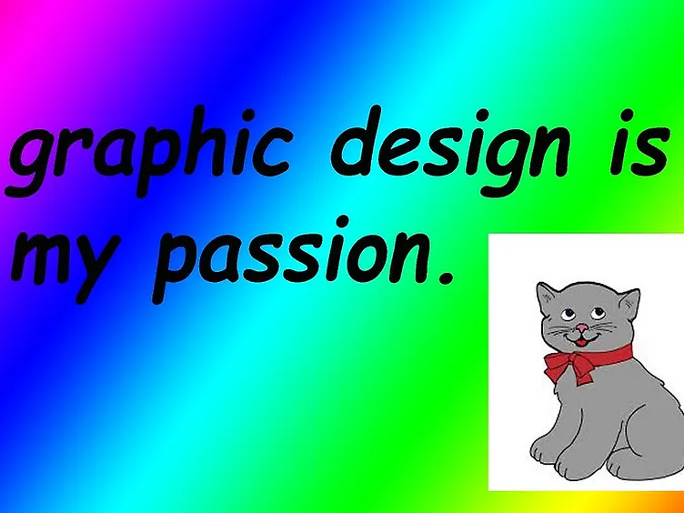

+++
title = 'About'
date = 2026-06-28T20:45:36+09:30
draft = false

[menu.main]
  name = "About"
  pageRef = '/about'
  weight = 30
+++

## About this blog

Good artists copy, great artists steal. Why reinvent the reel when you can just steal? 😼

Victims of theft:

- [probberechts/hexo-theme-cactus](https://github.com/probberechts/hexo-theme-cactus)
- [The Cyber Vanguard](https://cyber.dabamos.de/index.html)
- [SoHo Geocites, especially PAMS' PALACE](https://geocities.restorativland.org/SoHo/1045/)

## About Me

I study Software Engineering but I also do Human-Computer Interaction (HCI) stuff and read psychology stuff in my spare time.

This site is my attempt to design something as ugly and unconventional as possible while following Nielsen Norman's 10 Usability Heuristics and Usability.

## Contacts

You can find me on:

- [/gh/](https://github.com/fractuscontext)
- /e/ -> claire2026t [at] posteo [dot] net
